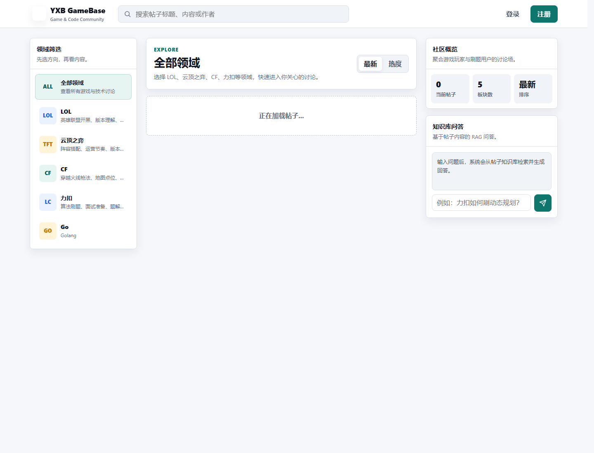

# Bluebell GameBase

Bluebell GameBase 是一个基于 Go + Gin 的游戏与刷题社区项目，支持用户登录注册、社区分区、帖子发布、投票、评论、图片上传，以及基于 Embedding + Milvus 的 RAG 检索问答能力。



## 功能特性

- 用户注册、登录与 JWT 鉴权
- 社区分区浏览，支持 LOL、CF、力扣、云顶之弈等板块
- 帖子发布、列表、详情、删除
- 帖子图片上传到腾讯云 COS，发布页支持图片预览
- 帖子列表首图缩略图，详情页真实图片渲染
- 点赞/反对投票与热度排序
- 评论发布与评论列表
- 基于帖子内容的 RAG 搜索与流式问答
- 帖子发布后可异步进行 AI 质量评分并影响排序
- 单页模板前端，支持中文搜索输入法组合输入

## 技术栈

- Go 1.23+
- Gin
- MySQL
- Redis
- Milvus
- Tencent COS SDK
- DashScope 兼容 OpenAI 接口
- Swagger
- Docker Compose

## 项目结构

```text
.
├─ cmd/                  命令行工具：重建 RAG、重算评分、探测评分等
├─ conf/                 示例配置
├─ docs/                 Swagger 文档与 README 图片
├─ internal/
│  ├─ controller/        HTTP handler
│  ├─ dao/               MySQL / Redis / Milvus 数据访问
│  ├─ logic/             业务逻辑
│  ├─ middlewares/       鉴权与限流中间件
│  ├─ models/            数据模型
│  ├─ router/            路由注册
│  └─ setting/           配置加载
├─ pkg/                  JWT、Embedding、RAG Chat、AI 评分等通用包
├─ static/               前端静态资源
├─ templates/            当前单页应用模板
├─ docker-compose.yml
├─ main.go
└─ README.md
```

## 快速开始

### 1. 克隆项目

```bash
git clone https://github.com/yyclha/bluebellproject.git
cd bluebellproject
```

### 2. 准备配置

仓库不会提交真实运行配置 `conf/config.yaml`，避免泄露数据库密码、模型 Key、COS 密钥等敏感信息。请从示例配置复制一份：

```bash
cp conf/dev.yml conf/config.yaml
```

Windows PowerShell:

```powershell
Copy-Item .\conf\dev.yml .\conf\config.yaml
```

然后按你的本地环境修改 `conf/config.yaml`：

```yaml
mysql:
  host: 127.0.0.1
  port: 3306
  user: "root"
  password: "your_mysql_password"
  dbname: "bluebell"

redis:
  host: 127.0.0.1
  port: 6379
  password: ""
  db: 0

embedding:
  enabled: false
  base_url: "https://dashscope.aliyuncs.com/compatible-mode/v1"
  api_key: ""
  model: "text-embedding-v4"

post_score:
  enabled: false
  base_url: "https://dashscope.aliyuncs.com/compatible-mode/v1"
  api_key: ""
  model: "qvq-max-2025-03-25"

rag_chat:
  enabled: false
  base_url: "https://dashscope.aliyuncs.com/compatible-mode/v1"
  api_key: ""
  model: "qvq-max-2025-03-25"

cos:
  enabled: false
  bucket_url: ""
  secret_id: ""
  secret_key: ""
  public_base_url: ""
  upload_prefix: "bluebell/posts"
  max_image_mb: 5
```

需要启用 RAG、AI 评分或图片上传时，再把对应模块的 `enabled` 改为 `true` 并填入自己的服务配置。`conf/config.yaml` 已在 `.gitignore` 中，不会被提交。

### 3. 初始化数据库

创建数据库：

```sql
CREATE DATABASE IF NOT EXISTS bluebell DEFAULT CHARACTER SET utf8mb4;
```

导入基础表：

```bash
mysql -uroot -p bluebell < bluebell_user.sql
mysql -uroot -p bluebell < bluebell_community.sql
mysql -uroot -p bluebell < bluebell_post.sql
```

Windows PowerShell:

```powershell
Get-Content .\bluebell_user.sql | mysql -uroot -p bluebell
Get-Content .\bluebell_community.sql | mysql -uroot -p bluebell
Get-Content .\bluebell_post.sql | mysql -uroot -p bluebell
```

评论表和帖子 AI 评分表会在服务启动时自动创建。

### 4. 启动服务

```bash
go run -buildvcs=false ./main.go ./conf/config.yaml
```

访问：

- 首页: `http://127.0.0.1:8084/`
- 发帖页: `http://127.0.0.1:8084/publish`
- 健康检查: `http://127.0.0.1:8084/ping`
- Swagger: `http://127.0.0.1:8084/swagger/index.html`

## 使用 Docker Compose 启动依赖

仓库提供了 `docker-compose.yml`，包含 MySQL、Redis、etcd、MinIO、Milvus 和应用服务。

```bash
docker compose up -d
docker compose ps
docker compose logs -f
```

如果只想启动依赖：

```bash
docker compose up -d mysql8019 redis507 etcd minio milvus-standalone
```

停止：

```bash
docker compose down
```

## 图片上传

图片上传接口：

```text
POST /api/v1/upload/image
```

前端发布页会把上传成功的图片放入预览区，不会把图片 Markdown 原文暴露在编辑框里。发布时图片地址会随帖子内容一起保存；列表页提取首张图作为缩略图，详情页渲染为真实图片。

启用 COS 示例：

```yaml
cos:
  enabled: true
  bucket_url: "https://<bucket>-<appid>.cos.<region>.myqcloud.com"
  secret_id: ""
  secret_key: ""
  public_base_url: ""
  upload_prefix: "bluebell/posts"
  max_image_mb: 5
```

也可以通过环境变量提供腾讯云密钥，避免写入配置文件：

```powershell
$env:TENCENT_COS_SECRET_ID="your_secret_id"
$env:TENCENT_COS_SECRET_KEY="your_secret_key"
```

## RAG 与 AI 评分

RAG 索引流程：

1. 将帖子标题和正文拼接为原始文本。
2. 按 `chunk_size` 和 `chunk_overlap` 切分片段。
3. 调用 Embedding 接口生成向量。
4. 将向量写入 Milvus。
5. 查询时检索相关 chunk，并用于 RAG 问答。

相关代码：

- `internal/logic/rag_chunk.go`
- `internal/logic/rag.go`
- `internal/dao/milvus/milvus.go`
- `pkg/embedder/embedder.go`
- `pkg/ragchat/ragchat.go`

重建 RAG 索引：

```bash
curl -X POST http://127.0.0.1:8084/api/v1/rag/reindex \
  -H "Authorization: Bearer <token>" \
  -H "Content-Type: application/json" \
  -d "{\"limit\":1000}"
```

帖子 AI 评分由 `post_score` 模块控制。启用后，发帖成功会异步调用模型给帖子打分，并把分数按 `score_weight` 折算后叠加到 Redis 排序分。

## 常用接口

注册：

```bash
curl -X POST http://127.0.0.1:8084/api/v1/signup \
  -H "Content-Type: application/json" \
  -d "{\"username\":\"test1\",\"password\":\"123456\",\"re_password\":\"123456\"}"
```

登录：

```bash
curl -X POST http://127.0.0.1:8084/api/v1/login \
  -H "Content-Type: application/json" \
  -d "{\"username\":\"test1\",\"password\":\"123456\"}"
```

帖子列表：

```bash
curl "http://127.0.0.1:8084/api/v1/posts2?page=1&size=10&order=time"
```

帖子详情：

```bash
curl "http://127.0.0.1:8084/api/v1/post/1"
```

发表评论：

```bash
curl -X POST http://127.0.0.1:8084/api/v1/comment \
  -H "Authorization: Bearer <token>" \
  -H "Content-Type: application/json" \
  -d "{\"post_id\":\"1\",\"content\":\"这是一条评论\"}"
```

## 开发命令

```bash
go fmt ./...
go vet ./...
go test ./...
go build -buildvcs=false ./...
```

Makefile：

```bash
make run
make build
make gotool
```

## 常见问题

### RAG 或问答不可用

确认 `embedding.enabled`、`rag_chat.enabled`、Milvus 地址、模型 Key 和模型名称是否正确。默认示例配置里这些功能是关闭的，避免没有外部依赖时启动失败。

### 图片上传失败

确认 `cos.enabled` 为 `true`，`bucket_url`、SecretId、SecretKey 正确，且 COS bucket 允许外部访问上传后的对象。

### 浏览器请求接口跨域

开发时尽量统一使用同一个 host，例如都使用 `http://127.0.0.1:8084`，不要页面用 `localhost` 而接口用 `127.0.0.1`。

## 安全说明

- 不要提交 `conf/config.yaml`。
- 不要把 DashScope Key、腾讯云 SecretId / SecretKey、数据库密码提交到仓库。
- `conf/dev.yml` 只保留可公开的示例配置。
