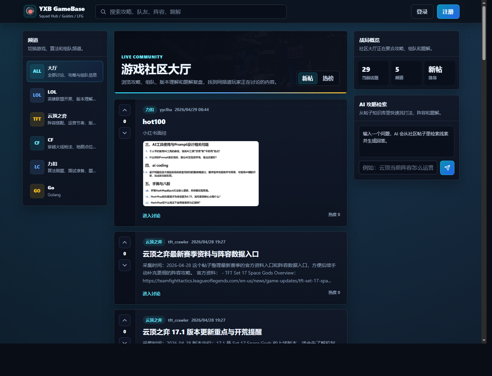

# GameBase

GameBase 是一个基于 Go + Gin 的社区论坛项目，提供用户注册登录、社区分类、帖子发布、评论、投票、图片上传、Swagger API 文档，以及围绕帖子内容构建的 RAG 检索与 AI 问答能力。

项目当前已经集成以下扩展能力：

- 基于 JWT 的登录鉴权
- 帖子、社区、评论、投票等基础论坛能力
- Swagger 接口文档
- 腾讯云 COS 图片上传
- 基于 Embedding + Milvus 的帖子向量检索
- 基于大模型的帖子 AI 评分
- 基于检索结果的流式 RAG 问答
- Docker Compose 本地联调环境

首页预览：



## 技术栈

- Go 1.14
- Gin
- MySQL
- Redis
- Milvus
- Swagger
- Tencent COS SDK
- DashScope 兼容 OpenAI 接口
- Docker Compose

## 项目结构

```text
.
├── cmd/                     辅助命令行工具
│   ├── post_score_probe/    AI 评分调试工具
│   ├── rag_rebuild/         RAG 索引重建工具
│   ├── rebuild_post_score/  帖子 AI 分数重建工具
│   └── tft_crawler/         游戏内容采集工具
├── conf/                    配置文件
├── docs/                    Swagger 文档与 README 图片资源
├── internal/
│   ├── controller/          HTTP 处理层
│   ├── dao/                 MySQL / Redis / Milvus 数据访问层
│   ├── logger/              日志模块
│   ├── logic/               业务逻辑层
│   ├── middlewares/         中间件
│   ├── models/              数据模型
│   ├── router/              路由注册
│   └── setting/             配置加载
├── pkg/                     通用能力封装
├── static/                  前端静态资源
├── templates/               HTML 模板
├── docker-compose.yml       本地依赖编排
├── Dockerfile               应用镜像构建文件
├── main.go                  程序入口
└── README.md
```

## 功能概览

### 基础论坛功能

- 用户注册与登录
- 社区列表与社区详情
- 帖子列表、帖子详情、发帖、删帖
- 评论列表与发表评论
- 帖子投票

### AI 与检索增强

- 发布帖子后可异步生成 AI 初始评分
- 帖子内容可按分块写入 Milvus 向量索引
- 支持基于帖子内容的 RAG 检索
- 支持结合检索结果进行流式 RAG 问答

### 媒体能力

- 支持上传帖子图片到腾讯云 COS

## 主要接口

公开接口：

- `POST /api/v1/signup`
- `POST /api/v1/login`
- `GET /api/v1/posts`
- `GET /api/v1/posts2`
- `GET /api/v1/community`
- `GET /api/v1/community/:id`
- `GET /api/v1/post/:id`
- `GET /api/v1/post/:id/comments`
- `GET /api/v1/me`
- `GET /api/v1/rag/search`
- `GET /api/v1/rag/chat/stream`
- `POST /api/v1/rag/chat/stream`

需要登录的接口：

- `POST /api/v1/post`
- `DELETE /api/v1/post/:id`
- `POST /api/v1/comment`
- `POST /api/v1/vote`
- `PATCH /api/v1/me/profile`
- `PATCH /api/v1/me/password`
- `POST /api/v1/rag/reindex`
- `POST /api/v1/upload/image`

## 用户中心流程

1. 登录后点击右上角用户名进入用户中心。
2. 可编辑头像、用户名、邮箱、性别和简介。
3. 可在密码区修改当前密码。

## 本地运行

### 1. 克隆项目

```bash
git clone https://github.com/yyclha/GameBase.git
cd GameBase
```

### 2. 准备配置文件

项目会默认读取 `./conf/config.yaml`。仓库里已经包含这个文件，也可以用 `conf/dev.yml` 作为参考模板进行覆盖。

示例：

```powershell
Copy-Item .\conf\dev.yml .\conf\config.yaml
```

当前开发配置里默认端口是 `8084`。

### 3. 准备 MySQL 与 Redis

先创建数据库：

```sql
CREATE DATABASE IF NOT EXISTS gamebase DEFAULT CHARACTER SET utf8mb4;
```

然后导入初始化 SQL：

```bash
mysql -uroot -p gamebase < gamebase_user.sql
mysql -uroot -p gamebase < gamebase_community.sql
mysql -uroot -p gamebase < gamebase_post.sql
```

Windows PowerShell 示例：

```powershell
Get-Content .\gamebase_user.sql | mysql -uroot -p gamebase
Get-Content .\gamebase_community.sql | mysql -uroot -p gamebase
Get-Content .\gamebase_post.sql | mysql -uroot -p gamebase
```

### 4. 启动服务

```bash
go run -buildvcs=false ./main.go ./conf/config.yaml
```

启动后可访问：

- 首页：`http://127.0.0.1:8084/`
- 健康检查：`http://127.0.0.1:8084/ping`
- Swagger：`http://127.0.0.1:8084/swagger/index.html`

## Docker Compose

项目提供了本地联调环境，包含：

- MySQL 8
- Redis 5
- Etcd
- MinIO
- Milvus
- GameBase 应用服务

启动：

```bash
docker compose up -d
docker compose ps
```

查看日志：

```bash
docker compose logs -f
```

只启动依赖服务：

```bash
docker compose up -d mysql8019 redis507 etcd minio milvus-standalone
```

停止并清理：

```bash
docker compose down
```

默认映射端口：

- 应用：`8888 -> 8084`
- MySQL：`33061 -> 3306`
- Redis：`26379 -> 6379`
- Milvus：`19530`
- MinIO：`9001`

## 配置说明

`conf/config.yaml` 中的核心配置包括：

- `mysql`：MySQL 连接信息
- `redis`：Redis 连接信息
- `milvus`：向量检索配置
- `embedding`：Embedding 模型配置
- `post_score`：帖子 AI 评分模型配置
- `rag_chat`：RAG 问答模型配置
- `cos`：腾讯云 COS 配置

示例片段：

```yaml
mysql:
  host: 127.0.0.1
  port: 23306
  user: "root"
  password: "1234"
  dbname: "gotest"

redis:
  host: 127.0.0.1
  port: 6379
  password: ""
  db: 6

milvus:
  enabled: false
  address: "127.0.0.1:19530"
  collection: "post_rag_chunk_1024"

embedding:
  enabled: false
  base_url: "https://dashscope.aliyuncs.com/compatible-mode/v1"
  api_key: ""
  model: "text-embedding-v4"

post_score:
  enabled: false
  base_url: "https://dashscope.aliyuncs.com/compatible-mode/v1"
  api_key: ""
  model: "qvq-max-2025-03-25"

rag_chat:
  enabled: false
  base_url: "https://dashscope.aliyuncs.com/compatible-mode/v1"
  api_key: ""
  model: "qvq-max-2025-03-25"

cos:
  enabled: false
  bucket_url: ""
  secret_id: ""
  secret_key: ""
  public_base_url: ""
  upload_prefix: "gamebase/posts"
  max_image_mb: 5
```

## 启用图片上传

启用 COS 上传时，至少需要配置：

```yaml
cos:
  enabled: true
  bucket_url: "https://<bucket>-<appid>.cos.<region>.myqcloud.com"
  secret_id: ""
  secret_key: ""
  public_base_url: ""
  upload_prefix: "gamebase/posts"
  max_image_mb: 5
```

也可以通过环境变量注入密钥：

```powershell
$env:TENCENT_COS_SECRET_ID="your_secret_id"
$env:TENCENT_COS_SECRET_KEY="your_secret_key"
```

对应接口：

```text
POST /api/v1/upload/image
```

## 启用 RAG 与 AI 能力

如果要启用向量检索、RAG 问答和 AI 评分，需要：

1. 将 `milvus.enabled` 设置为 `true`
2. 将 `embedding.enabled` 设置为 `true`
3. 将 `post_score.enabled` 设置为 `true`
4. 将 `rag_chat.enabled` 设置为 `true`
5. 配置对应的模型地址、API Key 和模型名

RAG 相关核心代码：

- `internal/logic/rag.go`
- `internal/logic/rag_chunk.go`
- `internal/dao/milvus/milvus.go`

AI 评分相关代码：

- `internal/logic/post_rag.go`
- `cmd/post_score_probe/main.go`
- `cmd/rebuild_post_score/main.go`

## Eino ADK 助手流程

当前 AI 助手已经改造成基于 Eino ADK 的单 Agent 架构，核心链路如下：

1. 前端为悬浮助手生成 `session_id`，请求 `/api/v1/rag/chat/stream` 时只传 `session_id`、`question` 和 `top_k`
2. 后端根据 `session_id` 从 Redis 读取最近对话历史，作为本轮会话上下文
3. `pkg/ragchat` 在启动时初始化 Eino `ChatModelAgent`
4. Agent 挂载一个 `retrieve_posts` 工具，用于检索社区帖子知识库
5. Runner 接收用户问题后，把最近对话和当前问题一并交给 Agent
6. Agent 优先调用 `retrieve_posts`
7. `retrieve_posts` 工具内部复用现有 RAG 检索链路：
   - Embedding 向量化
   - Milvus 相似度检索
   - MySQL 补全帖子标题与正文
8. 工具结果作为 ADK 的 tool message 回流给 Agent
9. Agent 基于工具结果生成最终中文回答
10. Runner 以流式事件输出回答，Gin 控制器继续通过 SSE 推送给前端
11. 回答完成后，后端把本轮 user / assistant 对话写回 Redis，会话可持续追问

相关代码入口：

- `pkg/ragchat/ragchat.go`
- `internal/logic/rag.go`
- `internal/dao/redis/assistant_session.go`
- `templates/index.html`

## 常用开发命令

```bash
make gotool
make build
make run
```

说明：

- `make gotool`：执行 `go fmt` 和 `go vet`
- `make build`：构建 Linux AMD64 二进制到 `bin/gamebase`
- `make run`：使用 `conf/config.yaml` 启动服务

## 说明

仓库已忽略以下本地文件：

- `conf/config.yaml`
- `bin/`
- `web_app.log`
- `.gocache/`

如果你要在生产环境部署，建议额外补充：

- 完整的环境变量说明
- 前后端部署方式
- 初始化演示账号
- API 调用示例
